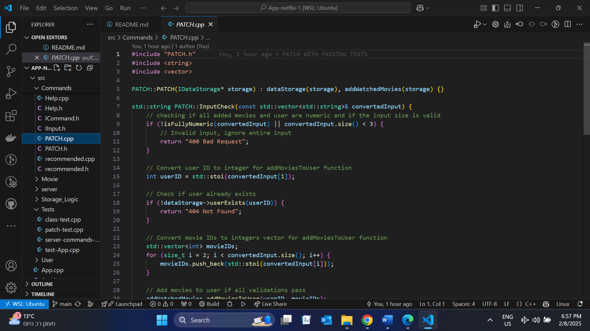
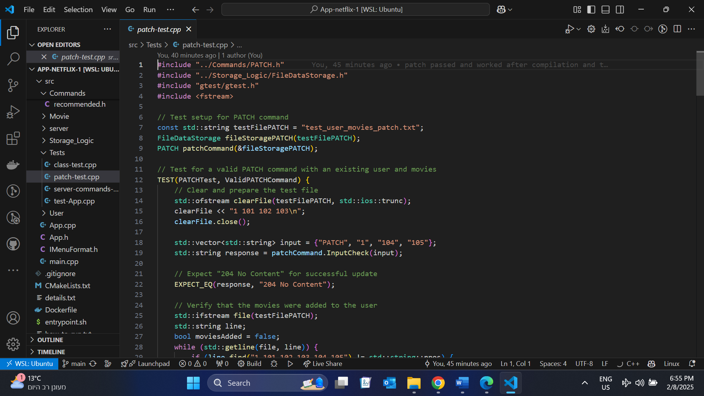
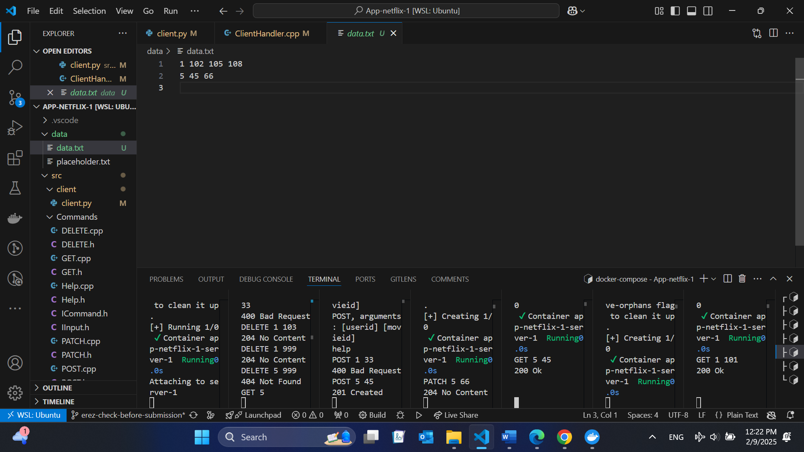

# App-netflix
https://github.com/GalPilowsky/App-netflix

running instructions in how_to_run.txt

  
  
  

Did the fact that the command names changed require you to modify code that is supposed to be "closed for modification but open for extension"?
No, we created new commands that used the existing implementation of the old commands.

Did the addition of new commands require you to modify code that is supposed to be "closed for modification but open for extension"?
No, we created new commands that used the existing implementation of the old commands.

Did the fact that the command output changed require you to modify code that is supposed to be "closed for modification but open for extension"?
Yes, we defined additional outputs for problematic inputs. However, in the future, we can utilize a class that defines the new command to implement these changes.

Did the fact that the input/output now comes from sockets instead of the console require you to modify code that is supposed to be "closed for modification but open for extension"?
No, in the original command code, we did not refer to the source of the input.

## to run the application please go to the file how_to_run.txt ##